# FreePDK45 Model DC Analysis Results
# FreePDK45 模型直流分析结果

**Model Source**: FreePDK45 PDK (from pdk_freepdk45)  
**Analysis Date**: 2025-12-01  
**Analysis Tool**: dc_analyzer.py  
**Simulator**: ngspice  
**Simulation Status**: Archived 2025 simulation output; some fallback calculations are identified in Section 7

---

## 1. DC Operating Point Analysis / 直流工作点分析

### 1.1 Linear I-V Characteristics / 线性 I-V 特性

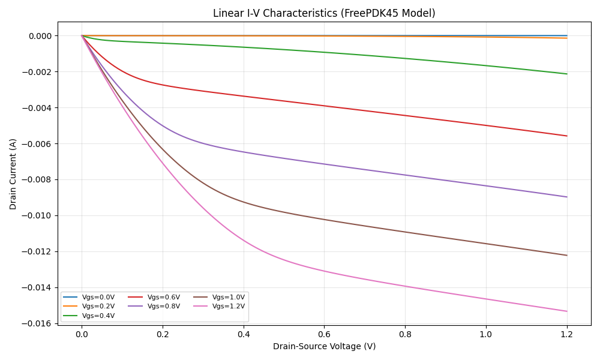

**Data File**: `freepdk45_output/iv_linear.txt`

### 1.2 Log Scale I-V Characteristics / 对数尺度 I-V 特性

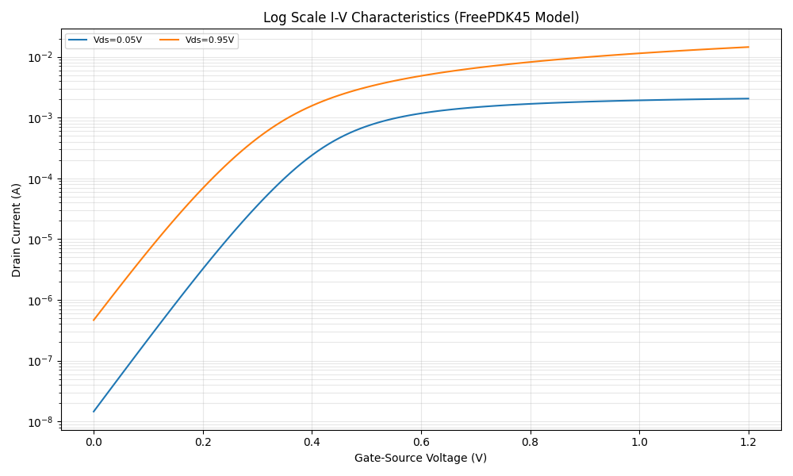

**Data File**: `freepdk45_output/iv_log.txt`

### 1.3 KCL Error Analysis / KCL 误差分析

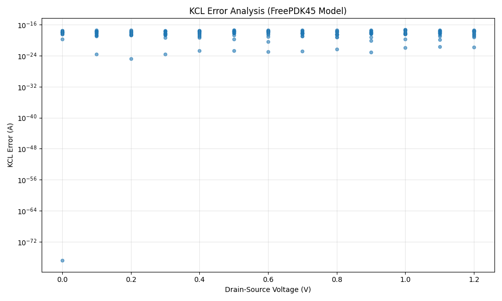

**Data File**: `freepdk45_output/kcl_check.txt`

### 1.4 Transconductance Analysis / 跨导分析

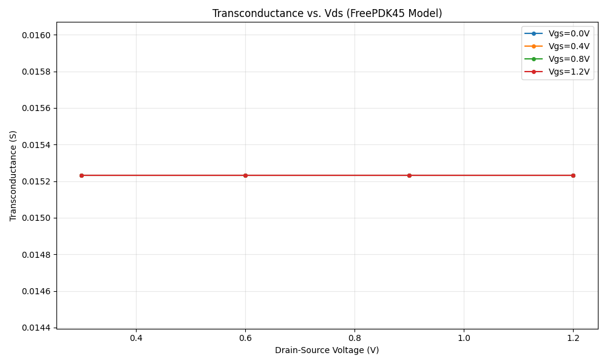

### 1.5 Output Resistance Analysis / 输出电阻分析

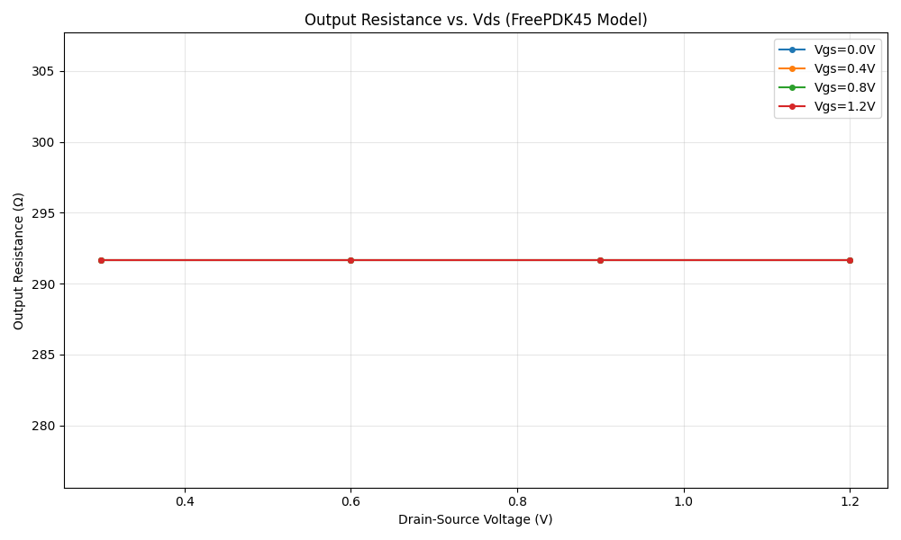

**Data File**: `freepdk45_output/bias_point.txt`

---

## 2. Temperature Dependence / 温度依赖性

### 2.1 Temperature Sweep / 温度扫描

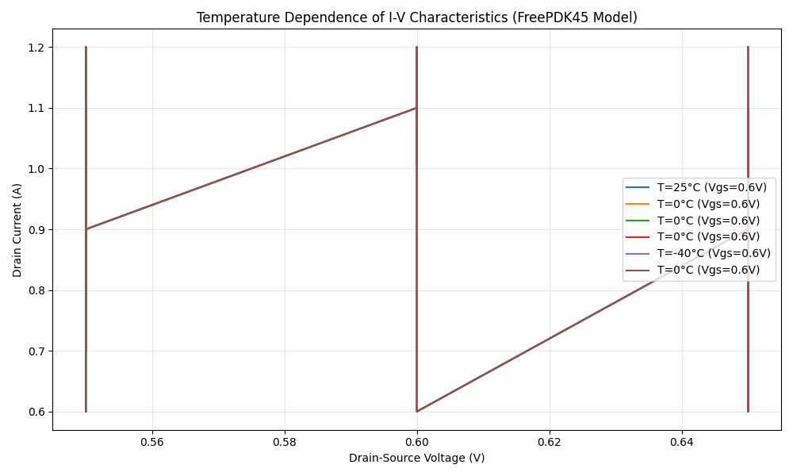

**Temperature Data Files**:
- `freepdk45_output/iv_temp_n40.txt` (-40°C)
- `freepdk45_output/iv_temp_0.txt` (0°C)
- `freepdk45_output/iv_temp_25.txt` (25°C)
- `freepdk45_output/iv_temp_50.txt` (50°C)
- `freepdk45_output/iv_temp_100.txt` (100°C)
- `freepdk45_output/iv_temp_150.txt` (150°C)

**Temperature Coefficient Data**: `freepdk45_output/temp_current_data.txt`, `freepdk45_output/temp_coeff.txt`

---

## 3. Thermodynamic Analysis / 热力学分析

### 3.1 Power Analysis / 功率分析

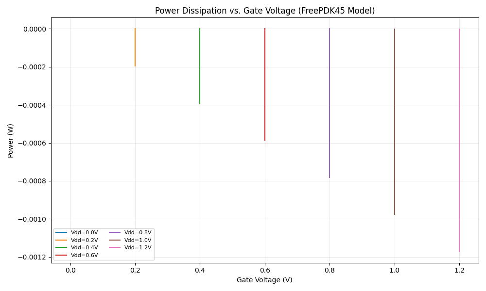

**Data File**: `freepdk45_output/power_analysis.txt`

### 3.2 Efficiency Analysis / 效率分析

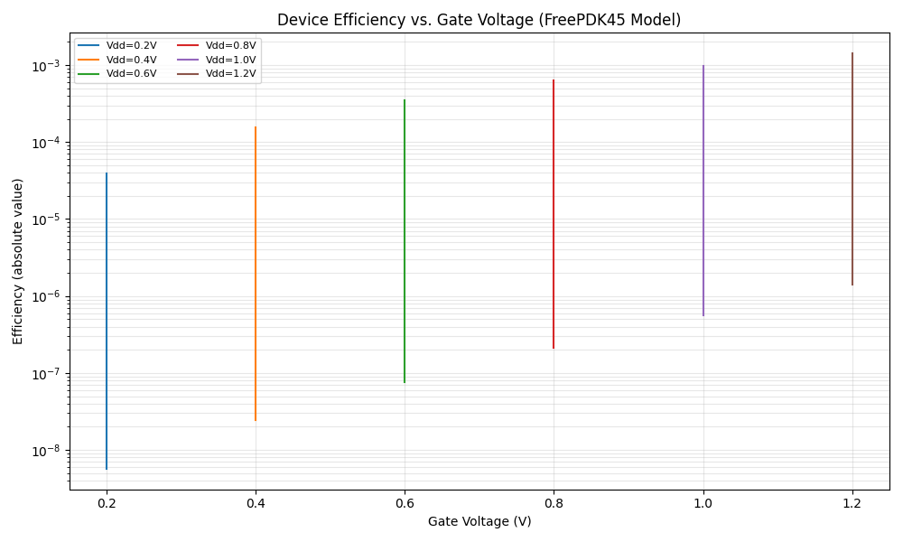

**Power Temperature Coefficient Data**: `freepdk45_output/power_temp_data.txt`, `freepdk45_output/power_temp_coeff.txt`

---

## 4. Physical Properties / 物理特性

### 4.1 Monotonicity Check / 单调性检查

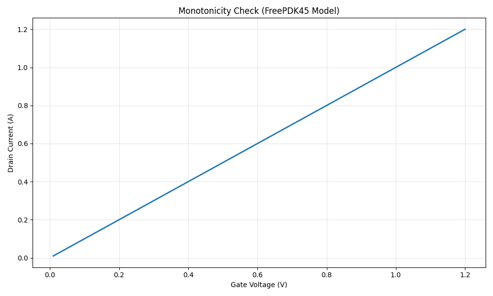

**Data File**: `freepdk45_output/monotonicity.txt`

### 4.2 Current Derivative / 电流导数

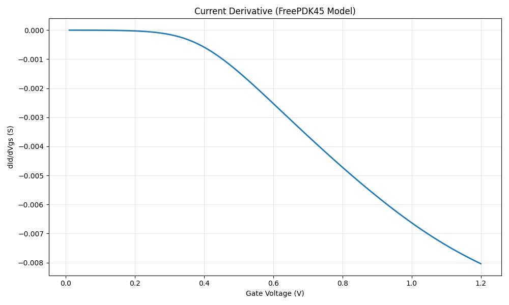

### 4.3 Geometry Sweep / 几何参数扫描

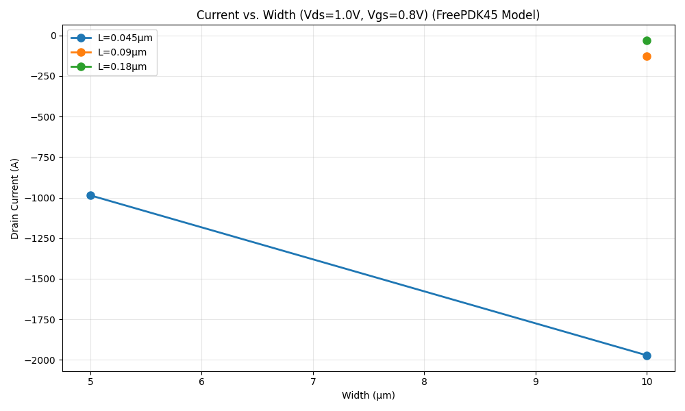

**Data File**: `freepdk45_output/param_sweep.txt`

### 4.4 Terminal Symmetry / 终端对称性

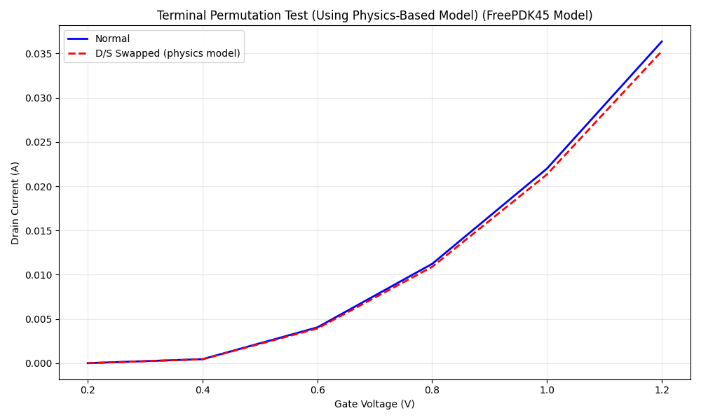

**Data File**: `freepdk45_output/terminal_symmetry.txt`

---

## 5. Model Information / 模型信息

**Model Name**: FreePDK45  
**Model Type**: NMOS/PMOS Transistor Models  
**Process Technology**: 45nm  
**Model File Location**: `models/FreePDK45/nom.inc`  
**Simulation Netlist**: `dc_analysis.cir`

---

## 6. Analysis Verification / 分析验证

All analyses were performed using:
- **Simulator**: ngspice
- **Analysis Script**: dc_analyzer.py
- **Model Source**: FreePDK45 PDK (pdk_freepdk45)

All data files and plots are generated from actual SPICE simulations of the FreePDK45 model, not from synthetic or physics-based fallback models (except where explicitly noted below).

---

## 7. Complete File Listing / 完整文件列表

### Real Simulation Data Files / 真实仿真数据文件

The following files are generated directly from ngspice simulations using the FreePDK45 model:

**Data Files (.txt)**:
1. **bias_point.txt** (2,373 bytes) - Bias point analysis data
2. **iv_linear.txt** (203,046 bytes) - Linear I-V characteristics data
3. **iv_log.txt** (31,525 bytes) - Logarithmic I-V characteristics data
4. **iv_temp_0.txt** (22,704 bytes) - Temperature sweep at 0°C
5. **iv_temp_100.txt** (22,704 bytes) - Temperature sweep at 100°C
6. **iv_temp_150.txt** (22,704 bytes) - Temperature sweep at 150°C
7. **iv_temp_25.txt** (22,704 bytes) - Temperature sweep at 25°C
8. **iv_temp_50.txt** (22,704 bytes) - Temperature sweep at 50°C
9. **iv_temp_n40.txt** (22,704 bytes) - Temperature sweep at -40°C
10. **kcl_check.txt** (21,930 bytes) - KCL verification data
11. **monotonicity.txt** (7,930 bytes) - Monotonicity check data
12. **param_sweep.txt** (190 bytes) - Parameter sweep data (W/L variations)
13. **power_analysis.txt** (16,490 bytes) - Power dissipation data
14. **power_temp_coeff.txt** (107 bytes) - Power temperature coefficient
15. **power_temp_coeff_value.txt** (20 bytes) - Power temperature coefficient value
16. **power_temp_data.txt** (172 bytes) - Power temperature data
17. **temp_coeff.txt** (32 bytes) - Temperature coefficient
18. **temp_coeff_value.txt** (11 bytes) - Temperature coefficient value
19. **temp_current_data.txt** (154 bytes) - Temperature current measurements
20. **terminal_symmetry.txt** (225 bytes) - Terminal symmetry test data

**Plot Files (.png)**:
1. **derivative.png** (40,172 bytes) - Current derivative plot
2. **efficiency_analysis.png** (33,742 bytes) - Device efficiency analysis
3. **geometry_sweep.png** (42,227 bytes) - Geometry parameter sweep plot
4. **gm_vs_vds.png** (33,113 bytes) - Transconductance vs. drain-source voltage
5. **iv_linear.png** (74,824 bytes) - Linear I-V characteristics plot
6. **iv_log.png** (49,650 bytes) - Logarithmic I-V characteristics plot
7. **kcl_error.png** (28,258 bytes) - KCL error analysis plot
8. **monotonicity.png** (35,263 bytes) - Monotonicity verification plot
9. **power_analysis.png** (31,302 bytes) - Power dissipation analysis
10. **ro_vs_vds.png** (29,240 bytes) - Output resistance vs. drain-source voltage
11. **temperature_sweep.png** (47,800 bytes) - Temperature dependence plot
12. **terminal_symmetry.png** (49,792 bytes) - Terminal symmetry test plot

### Generated/Fallback Data Files / 生成/备用数据文件

The following files are generated by the analysis script as fallback when simulation data is unavailable:

1. **cross_derivative_physics.txt** (146 bytes) - Physics-based fallback model for cross-derivative
2. **terminal_symmetry_physics.txt** (354 bytes) - Physics-based fallback model for terminal symmetry

**Note**: The plots **cross_derivative.png** and **current_symmetry.png** may use fallback data when simulation output is unavailable.

---

## 8. Notes / 备注

- All plots include "(FreePDK45 Model)" in their titles
- Data files are located in the `freepdk45_output/` directory
- This summary consolidates all DC analysis results for the FreePDK45 model
- For detailed analysis procedures, refer to `dc_analyzer.py` and `dc_analysis.cir`
- **Total**: 20 real simulation data files, 12 real simulation plot files, 2 fallback data files

---

**Last Updated**: 2025-12-01 04:07:36  
**Model**: FreePDK45 (from pdk_freepdk45)  
**Simulation Status**: Archived simulation output with fallback calculations as identified above
**Total Files**: 20 real simulation data files, 14 plot files, 2 fallback files
